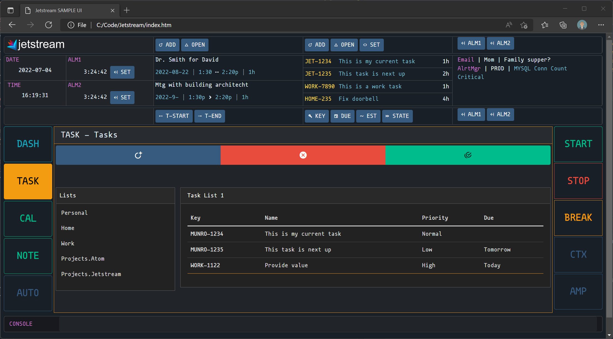

---

Jetstream is a web-based software suite for building custom software tools that centralize Information, Data and Resources (IDR). Emails, Calendar Events, Alarms, Vehicles, Help Articles are all examples of IDR that we conventionally manage using a few apps and services. The goal of Jetstream is to re-centralize those tools by wrapping custom IT tools and integrated 3rd party services into a single, deployable application.

By taking inspiration from efficient and reliable industries like aviation, engineering, health and military, Jetstream provides tools for Modeling, Controlling and Instrumenting (MCI) this IDR and creating ergonomic interfaces.  


The sample above ([index.htm](Frontend/index.htm)) is just one interpretation of a multifunction Task/Event/Communication management and notification system.

## How it works (More to come...)
Most software languages and tools tend to think of information in terms of Classes, Types or Tables. Jetstream uses Info `Kinds` to label and prototype, but not define patterns of information.

## Jetstream Process
The acronym `MITER` is useful for remembering process for handling IDR:
``` 
- M -  Model           Determine key IDR Kinds and their prototypes
- I -  Integrate       Inject real-world data (Manual entry, 3rd Party API, File)
- T -  Tool            Build scripts, schedules, screens, alarms, etc.
- E -  Employ          Use the tools -> Record feedback and telemetry -> Deliver
- R -  Reflect+Redo    Review telemetry -> Improve ->
```

## Core IDR Kinds
Jetstream uses *Kinds* to capture patterns of Information, Data and Resources. Since some Kinds of IDR are ubiquitous across teams, cultures and locations (Calendars, Alarms, Grocery Lists, etc.) Jetstream includes the following core *Kinds* to: A) Provide a solid start to prototyping your own kinds and B) to enable simple configuration and integration with the Jetstream core:

- `Note` - Simple `Name` and `Content` message to yourself.
- `TaskList` - A collection of tasks
- `Task` - Something that needs doing; Optionally it may have a deadline
- `Schedule` - Calendars, CRON expressions, iCal feeds. A collection of `ScheduleEvents`
- `ScheduleEvent` - Meetings, appointments, or other time based commitment.
- `Alarm` - Any time a person needs to be notified visually or auditorily. May optionally require acknowledgement for accountability.
- `Message` - A human-readable message with attached data
- `ServiceLink` -  A software component that establishes standardized communication between Jetstream and house-built and 3rd party services. ServiceLinks provide bidirectional communication by converting 3rd party data into Jetstream Resources and v. versa.
- `Screen` - View for a resource or set of resources


